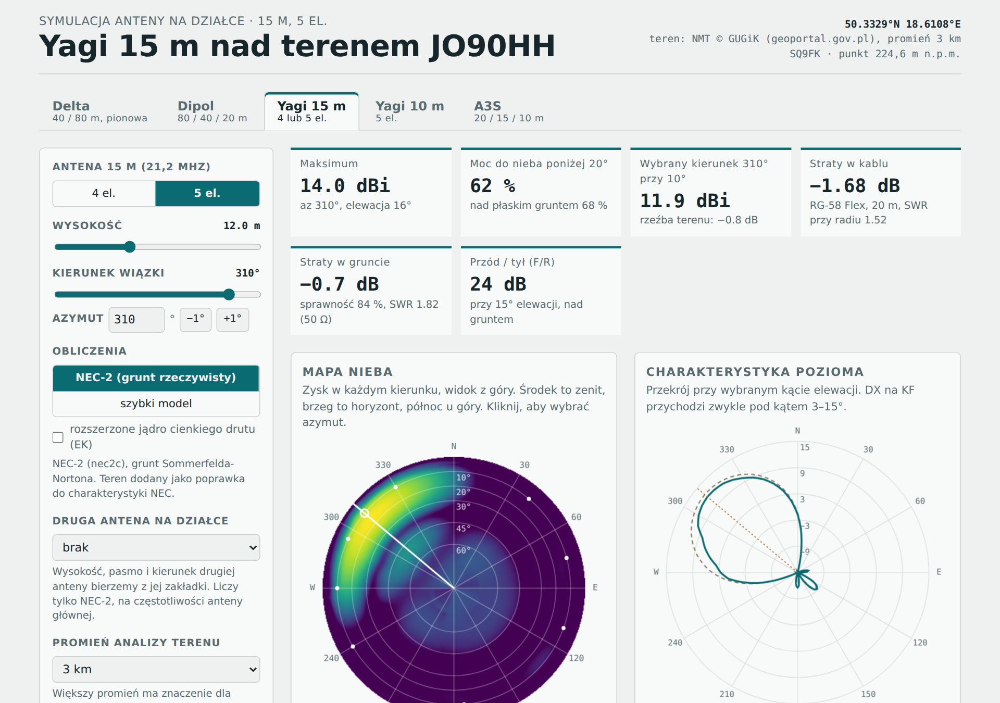
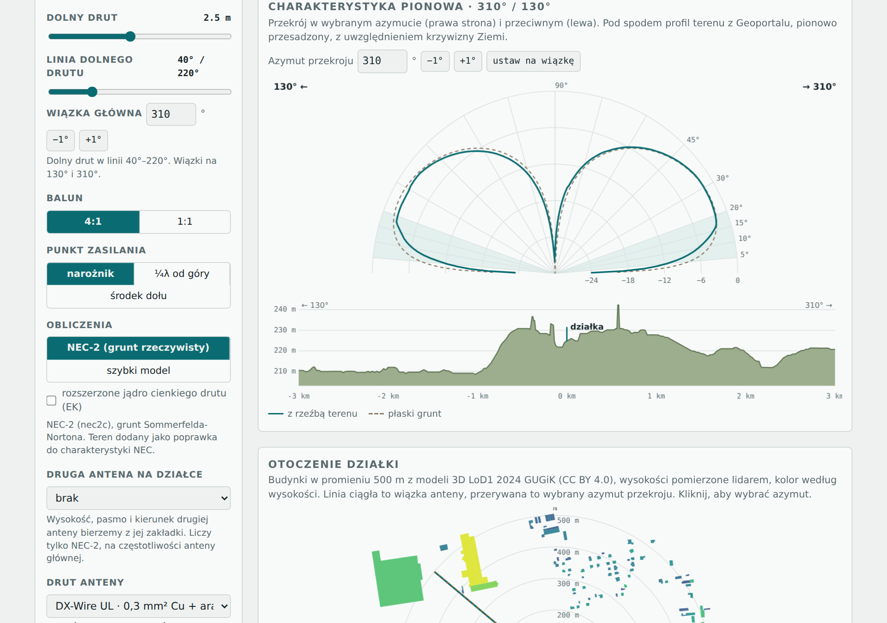
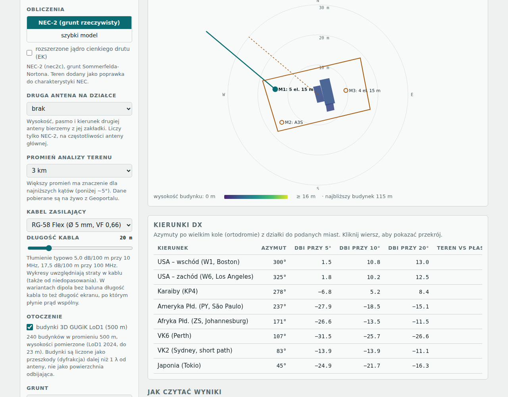

# Anteny JO90HH — symulator anten KF nad rzeczywistym terenem

**[▶ Otwórz symulator: sq9fk.github.io/anteny-sq9um](https://sq9fk.github.io/anteny-sq9um/)**

Przeglądarkowy symulator anten krótkofalowych dla konkretnej lokalizacji. Liczy charakterystyki promieniowania silnikiem **NEC-2**, z rzeczywistym gruntem, i dodaje wpływ **ukształtowania terenu** z numerycznego modelu terenu **GUGiK (Geoportal)**. Działa w całości w przeglądarce, bez instalacji i bez serwera.

Projekt powstał przy planowaniu anten DX na działce w lokatorze **JO90HH** (okolice Gliwic) dla stacji **SQ9UM**.

Siostrzany projekt dla działki SQ9FK w JO90HI: [sq9fk.github.io/anteny-sq9fk](https://sq9fk.github.io/anteny-sq9fk/).



---

## Co potrafi

**Anteny (zakładki):**

| Zakładka | Pasma | Parametry |
|---|---|---|
| **Delta** (pionowa polaryzacja) | 80 m, 40 m, dowolny rezonans | wysokość wierzchołka i dolnego drutu, punkt zasilania (narożnik, ¼λ od góry, środek dołu), azymut co 1° |
| **Dipol** | 80 / 40 / 20 m, dowolny rezonans | wysokość, płaski lub odwrócone V, obrót co 1°, kąt między ramionami w rzucie z góry 30–180° (dipol zgięty w V), dopasowanie do działki |
| **Yagi 15 m** | 21,2 MHz | 4 lub 5 elementów, wysokość, azymut co 1° |
| **Yagi 10 m** | 28,5 MHz | 5 elementów, wysokość, azymut co 1° |
| **Cushcraft A3S** | 20 / 15 / 10 m | wysokość, azymut co 1° |
| **Hexbeam** G3TXQ (SP7IDX) | 20 / 17 / 15 / 12 / 10 / 6 m | wysokość, azymut co 1°, opcjonalne dostrojenie drivera do rezonansu |
| **Quad Cubex SkyMaster III** | 20 / 17 / 15 / 12 / 10 m | 3 el., wymiary z instrukcji Cubex, wysokość boomu, azymut co 1°, dopasowanie wg instrukcji (λ/4 RG-11) albo kabel 50 Ω wprost, opcjonalnie z pętlami pozostałych pasm |

**Zysk katalogowy:** zysk w wolnej przestrzeni (dBi i dBd, dla anten kierunkowych także F/B) liczony w NEC-2, dla porównania z danymi producentów i z zyskiem nad gruntem.

**Wyniki:**

- mapa nieba (zysk w każdym kierunku i przy każdym kącie elewacji),
- charakterystyka pozioma dla wybranego kąta i pionowa dla wybranego azymutu,
- profil terenu w wybranym kierunku (z krzywizną Ziemi),
- tabela kierunków DX (USA, Karaiby, PY, ZS, VK, JA) z zyskiem przy 5°, 10° i 20° oraz wpływem terenu,
- impedancja wejściowa, SWR przy 50 Ω, sprawność i straty w gruncie,
- F/R dla anten kierunkowych,
- dostrojenie delty i dipola do rezonansu oraz **długość do cięcia** dla wybranego drutu.

**Dodatkowo:**

- **Zasilanie:** delta z balunem 4:1 albo 1:1 (SWR liczony względem 200 Ω albo 50 Ω). Dipol w trzech wariantach: balun 1:1, bez baluna z automatycznym tunerem eATU (SP9MK) przy antenie albo bez baluna. W wariantach bez baluna NEC-2 modeluje ekran kabla, po którym płynie prąd wspólny. Dla eATU strona podaje potrzebne L i C oraz straty w dopasowaniu.
- **Kabel zasilający:** RG-58 Flex albo RF-7 o wybranej długości. Strona liczy tłumienie, dodatkowe straty od niedopasowania i SWR przy radiu, a wykresy uwzględniają straty w kablu. W wariantach bez baluna długość kabla jest też długością ekranu, po którym płynie prąd wspólny.
- **Dipol w działce:** oba ramiona można obracać razem, zmieniać kąt między nimi w rzucie z góry (180° = prosty dipol, mniej = litera V) albo wpisać azymuty ramion wprost. Plan pokazuje ramiona od masztu (albo od wybranego punktu na działce) i ostrzega, gdy któreś wychodzi poza granicę. Przyciski „dopasuj kąt ramion” (przy zachowanym kierunku) i „najlepsze ułożenie” szukają najbardziej rozwartego układu, który mieści się w działce z zapasem 0,5 m. Zgięty dipol ma w NEC-2 własny rezonans, niższą impedancję i bardziej dookólną charakterystykę.
- **Plan działki SQ9UM:** granica działki (ok. 33 × 17 m), trzy maszty (M1: Yagi 5 el. 15 m, M2: A3S, M3: Yagi 4 el. 15 m) oraz przyczepa, altana i garaż. Położenie wzięte ze zrzutu z Geoportalu. Wiązka rysowana jest od masztu danej anteny (odległości między masztami: M1–M2 11 m, 169°; M1–M3 24 m, 91°). Plan ma trzy skale: działka, 150 m i 500 m. Maszty mają regulowaną wysokość, domyślnie 7 m. Każdą antenę (także deltę, dipol, Yagi 10 m, hexbeam i quad) można przypisać do dowolnego masztu albo do środka działki. Od masztu liczone są odległości do pozostałych anten i do metalowych obiektów.
- **Metal na działce:** domek (metalowa przyczepa holenderska, ok. 3 m) i garaż blaszany (2,15 m) są liczone w NEC jako siatki przewodów, dla anten na masztach M1–M3. Drewniana altana nie jest liczona. Przykład: przy Yagi 4 el. na M3, 4–5 m od domku, F/R spada z 21 do 20 dB.
- **Budynki 3D:** zabudowa w promieniu 500 m z modeli LoD1 2024 GUGiK, z wysokościami pomierzonymi lidarem, wliczona do poprawki od otoczenia. Do tego plan otoczenia z zaznaczoną wiązką.
- **Druty DX-Wire:** UL, FL, FS, HDL, PREMIUM, goły drut albo własny współczynnik skrócenia izolacji.
- **Grunt:** słaby, przeciętny albo dobry.
- **Promień analizy terenu:** 3 km (dane wbudowane) albo 5, 10, 15 lub 20 km (pobierane na żywo z Geoportalu).
- **Pozostałe anteny na masztach:** NEC-2 liczy antenę z otwartej zakładki razem ze wszystkimi antenami przypisanymi do masztów, z odległościami i kierunkami z planu działki, i pokazuje, ile dB zabiera sprzężenie. Anteny na tym samym maszcie też się liczą (np. dipol pod Yagi), o ile druty są co najmniej 0,5 m od siebie. Pozostałe anteny mogą być podłączone (50 Ω) albo rozwarte. Wyłączenie opcji liczy samą antenę.
- **Linki do zakładek:** np. `#delta`, `#dipole`, `#y15`, `#y10`, `#a3s`, `#hex`, `#quad`.





---

## Jak to jest liczone

### 1. Antena i grunt: NEC-2

Charakterystyki, impedancje, rezonans i straty w gruncie liczy **nec2c**: implementacja NEC-2 w C, ten sam silnik obliczeniowy, którego używa 4nec2. Program jest skompilowany do **WebAssembly** i uruchamiany w Web Workerze.

- grunt **Sommerfelda-Nortona** (`GN 2`) o wybranych εr i σ,
- charakterystyka co 1° w elewacji i co 5° w azymucie (`RP 0 91 72 1001`),
- sprawność z uśrednionego zysku (straty w gruncie),
- delta i dipol dostrajane metodą siecznych do X = 0 na zadanej częstotliwości,
- opcjonalnie rozszerzone jądro cienkiego drutu (`EK`).

### 2. Rzeźba terenu: poprawka w stylu HFTA

NEC-2 obsługuje tylko płaski grunt. Wpływ ukształtowania terenu jest więc dodawany jako **poprawka** do wyniku NEC. Liczy ją osobny model odbić dla prądów wziętych z NEC:

- odbicie od płaszczyzny dopasowanej do terenu w **pierwszej strefie Fresnela**, ze współczynnikami Fresnela dla polaryzacji pionowej i poziomej,
- wzniesienia dalej niż 300 m liczone jako przeszkoda typu **ostrze noża**,
- **krzywizna Ziemi** ze współczynnikiem refrakcji 4/3,
- wynik: `G = G_NEC(płaski) + [G_teren − G_płaski]` z modelu odbić.

Linia przerywana „płaski grunt” na wykresach to czysty wynik NEC-2.

### 3. Dane terenu

Numeryczny model terenu (NMT) **GUGiK** jest pobierany usługą `services.gugik.gov.pl/nmt` w układzie PUWG 1992 (EPSG:2180): 72 profile co 5°, próbka co 25–100 m. Usługa zwraca nagłówki CORS, więc strona pobiera dane bezpośrednio w przeglądarce. Profile do 3 km są wbudowane w stronę, a większe promienie przeglądarka zapamiętuje po pierwszym pobraniu.

---

## Ograniczenia

- Terenu nie liczy NEC. Poprawka od rzeźby terenu jest przybliżeniem, podobnie jak w HFTA. Najmniej pewna jest dla anten zawieszonych bardzo nisko (poniżej ~0,1 λ).
- Budynki wchodzą tylko do poprawki od terenu, jako przeszkody z dyfrakcją na krawędzi (od 30 m), a nie do obliczeń NEC. Najbliższy budynek stoi ok. 130 m od działki, więc nie ma sprzężenia w polu bliskim. Wysokości pochodzą z pomiaru lidarowego (LoD1 2024).
- Model nie uwzględnia drzew, masztów, odciągów, kabla przy antenie z balunem ani altany, strat w materiale elementów ani układów dopasowania (hairpin, gamma).
- NEC-2 nie modeluje izolacji drutu. Uwzględnia ją współczynnik skrócenia liczony z geometrii przewodu, bo producent DX-Wire go nie podaje. Zostaw 3–5% zapasu i dotnij analizatorem.
- Wymiary Yagi dobrano w NEC-2 dla rurek Ø 20 mm (15 m) i Ø 16 mm (10 m). Przed budową uwzględnij mocowania elementów do boomu.
- Hexbeam: wymiary 20–10 m z tabeli G3TXQ, 6 m przeskalowane z 10 m. Model liczy jedno pasmo naraz, bez drutów pozostałych pasm, dlatego driver jest domyślnie dostrajany do rezonansu.
- Quad Cubex: boki pętli z tabeli IIb instrukcji, drut Ø 1,6 mm (AWG 14; instrukcja nie podaje średnicy), boom i maszt pominięte. Z pętlami pozostałych pasm ich drivery są zamknięte 50 Ω, jak przy osobnych kablach albo przełączniku; transformatora MT-3 nie modeluję. Opcja 6 m nie jest liczona, bo instrukcja nie podaje wymiarów.
- A3S jest modelowana jako elementy pełnowymiarowe z 0,5 dB strat w trapach. Rozstaw elementów jest przybliżony.
- Azymuty kierunków DX są orientacyjne.

---

## Użycie lokalne

To jedna samodzielna strona. Wystarczy otworzyć `index.html` w przeglądarce. Do pobierania terenu dla promienia większego niż 3 km potrzebny jest internet.

Publikacja na GitHub Pages: **Settings → Pages → Deploy from a branch → `main` / root**.

### Przeniesienie na inną lokalizację

Współrzędne działki są w `index.html`:

- `SITE = {N: …, E: …}` to punkt w PUWG 1992 (x = północ, y = wschód),
- `TERRAIN_LINES` to wbudowane profile 3 km; po zmianie lokalizacji wybierz promień 5 km lub więcej, żeby pobrać świeże dane,
- tekst w nagłówku strony.

---

## Struktura repozytorium

```
index.html          symulator (HTML + JS; wbudowany nec2c.wasm w base64)
nec2c-wasm/         źródła nec2c i opis kompilacji do WebAssembly (GPL-3.0)
docs/               zrzuty ekranu do README
```

Kompilacja silnika opisana jest w `nec2c-wasm/BUILD-WASM.txt`: clang 18 z celem `wasm32-wasi`, `wasi-sysroot` 24, jedna zmiana w `main.c` (wyłączona obsługa sygnałów pod WASI).

---

## Licencja i źródła

- **Silnik NEC-2:** [nec2c](https://github.com/KJ7LNW/nec2c), autor Neoklis Kyriazis 5B4AZ, obecnie rozwijany przez KJ7LNW. Licencja **GPL-3.0**. Źródła użyte do kompilacji są w katalogu `nec2c-wasm/`.
- **Dane wysokościowe:** NMT © [Główny Urząd Geodezji i Kartografii](https://www.geoportal.gov.pl/).
- **Budynki:** modele 3D budynków LoD1 2024 © [GUGiK](https://www.geoportal.gov.pl/), licencja CC BY 4.0.
- **Kable:** tłumienie RF-7 według katalogu (2,0 dB/100 m przy 10 MHz). Dla RG-58 Flex przyjęto typowe wartości katalogowe.
- **Quad:** wymiary z instrukcji Cubex SkyMaster III (Cubex Co., Inc., rev. 05-06).
- **Dane drutów:** tabela przewodów [DX-Wire](https://www.dx-wire.de/).
- **Kod strony:** GPL-3.0, zgodnie z licencją wbudowanego silnika nec2c.

---

73 de **SQ9UM**
